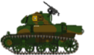
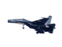
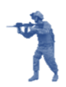
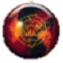
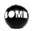
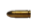
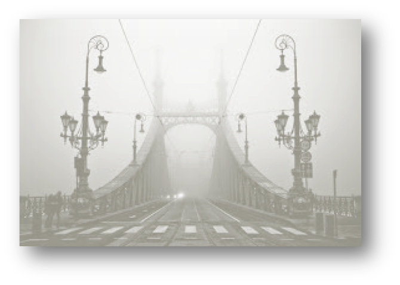
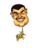

# Game Design
In this game, I have one player against many bad things. They are soldiers, bullets, Rocks, tanks, planes and bombs) .

## Movement
### Plane 
flying straight in the sky, not harming players directly, but can release bombs

### Tank
Running straight towards the player on the ground. The player must jump over it or kill it.

### Soldier
Walking from the right to the left. Soldier can do harm on player both by himself or by the bullets he emits.

### Rock
Rock looks like a big ball.The way it moves looks like rebouncing on the ground. it can do harm to the player by touching the player. 

### Bomb
Bombs are always dropped from the planes. After they are released from the plane, they both moving forward and moving down to the ground to hit the player.

### Bullets
Bullets are small but can harm players directly. They move from the right to the left at a relatively low speed.
# How to play?
users use keyboard to control the player. UP is jump. LEFT and RIGHT is control moving player towards left and right. Space is open the fire (a basketball).

Before clicking the start button, users should enter their names first. Otherwise, the game won't start.
# Score
The score can't go down. Every time you kill a bad thing, you can add corresponding points of that thing. 

For example, one hit on a tank is worth 300 points, but you must hit a tank 4 times to kill it (make it disapear) . so if you kill a tank, you get more points than killing a soldier.
The final score is the score when you died. Notice that even though you didn't kill a bad thing, you can still get partial points for hitting on it.

# Lives
The user should control the player to avoid the attack of bad Things. if the player is touched by any Bad Thing, the player lost a life. Initially, every player has three lives.
When the player lost three lives, game is over. A message will print out indicating the final score the user gets.

# User Interface
Menu Bar: I will include an action called Exit to completely terminate the program

Tool Bar: Start Game, Pause/resume Game, Exit game, Finish Game

# Pictures

